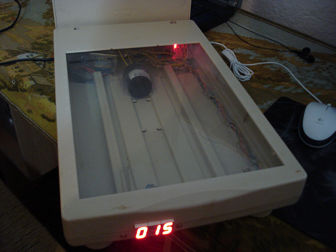

# pcb-exposure-box
PCB Exposure Box made of an old Scanner

When you set the timer (max 999 seconds) with UP/DOWN buttons and then press button START, micro-controller-unit (MCU) PIC16F84A will turn on light and start to countdown to zero. When timer comes to zero, MCU will turn off the light signaling via the piezzo speaker that exposure process is done.

# Video presentation

Click [here](https://www.youtube.com/watch?v=MrX0DLpo7UE) to watch short video presentation on YouTube.
_Video was recorded back in 2013 and quality of video is very bad (sorry about that)._

# Development Environment

- MCU used for realization of this project is PIC16F84A and software for them is written in C using (and compiled with) [mikroC environment](https://www.mikroe.com/mikroc-pic)
- PCBs were designed using the [Eagle](https://www.autodesk.com/products/eagle/overview)
